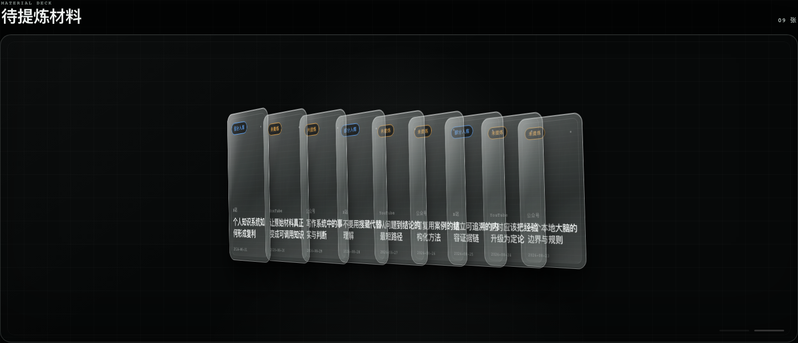
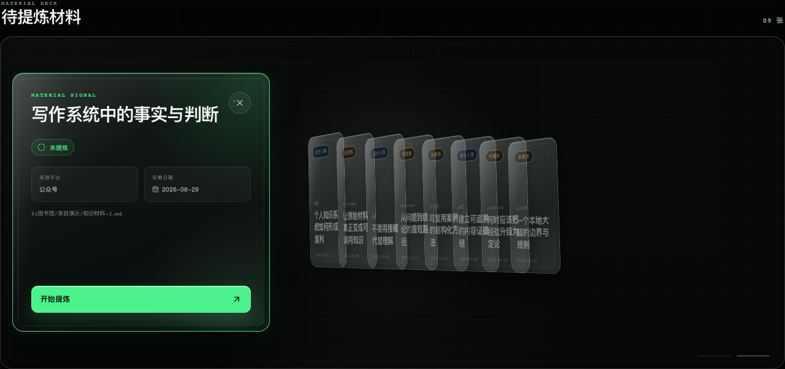
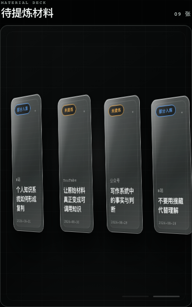

# 最佳拍档

<p align="center">
  
</p>

<p align="center">
  <strong>把收藏的资料，变成以后能再次使用的知识。</strong><br />
  一个只在你的 Mac 上运行的个人资料整理工具：把 Markdown、浏览器剪藏和资料文件整理成可搜索、可追溯的知识库。
</p>

适合想长期积累资料、又希望原文默认留在自己电脑上的人。你可以先只做本地整理；使用 AI 时，只有你确认的内容才会发送给 DeepSeek，并可能产生服务商费用。

### 第一次使用

1. 创建或选择“我的大脑”（一个保存资料和知识的本地文件夹）。
2. 首次启动会创建一套公开 starter 模板；可按首页清单安装浏览器剪藏插件并测试连接（插件不是必需条件）。
3. 收藏网页，或直接导入一份 Markdown/文本资料；资料会先进入收件箱。
4. 打开“提炼队列”，生成并确认第一条可搜索知识。

“收件箱”就是待整理资料；“提炼”就是让 AI 生成可编辑草稿；“入库”就是你确认后保存为可搜索笔记。

浏览器插件只申请当前页面读取和本地 Native Messaging 权限，不读取账号、cookies 或历史记录。插件安装包随桌面包提供；连接失败时可在扩展设置重试，文件导入和粘贴文本始终可用。starter 模板是公开示例，不包含作者个人资料、密钥或本机路径。

当前只支持 Apple Silicon Mac。可以下载 [Apple Silicon 开发者预览版](https://github.com/zhouao010809-code/best-partners/releases/tag/v0.1.0-preview.1)；它尚未完成签名和公证，正式使用前请先阅读 Release 说明。

<p align="center">
  <a href="#核心闭环">核心闭环</a> ·
  <a href="#现在能做什么">现在能做什么</a> ·
  <a href="#在这台-mac-上使用">开始使用</a> ·
  <a href="docs/reviews/2026-09-11-first-run-walkthrough.md">首次使用验收</a> ·
  <a href="LICENSE">使用边界</a>
</p>

## 核心闭环


每一步都保留预览、确认和恢复入口：AI 不会自动发送，知识也不会自动写入。

## 界面预览

先在“待提炼材料”里浏览已归档资料，再打开单份材料查看来源、状态和下一步操作；手机宽度也会自动收拢为可滚动的材料卡片。

<p align="center">
  
</p>

<p align="center">
  
</p>

<p align="center">
  
</p>

以上截图使用隔离测试资料，仅用于展示界面结构，不包含真实账号或个人资料。

## 现在能做什么

| 工作 | 你能得到什么 |
| --- | --- |
| 收集资料 | 浏览器剪辑插件、文件选择或粘贴文本都可以进入收件箱 |
| 整理归档 | 补齐标题、来源和日期，预览目标位置后再归档，原文和附件保留 |
| 问问 AI | 对整个大脑或当前资料提问，查看引用、历史和实际阅读范围 |
| 提炼知识 | 用 DeepSeek 生成候选，编辑后选择保留、放弃或稍后处理 |
| 找回依据 | 从知识回到原始资料，查看来源和关联内容 |
| 管理本地 Skill | 在 Skill 库创建一层自定义文件夹、手动移动 Skill，并在访达定位源文件；Skill 内容仍由本地文件维护 |
| 安全恢复 | 操作记录、失败重试、入库恢复和统一回收站都可追溯 |

这是本地个人 App，不是多人协作 SaaS；资料、草稿和密钥默认留在本机。

下面是完整能力、限制和开发验证记录；只想快速了解和试用产品的读者，看到这里就可以开始操作。

## 问问与本地文件（2026-09-10）

- 问问标题栏提供“新对话”和可搜索、分页的历史。未发送文字和附件选区保存到当前大脑的本机数据库，切换对话、关闭窗口或重启后可恢复。“带摘要继续”生成可编辑的新草稿，由用户发送。
- 上下文圆环显示最近模型步骤的实际输入加输出占用，不将多步累计消耗当作上下文。点击可查看模型容量、历史带入范围、文件和实际读取的来源。没有真实回执时显示待统计，容量未知时不生成百分比；输入改动后保留上一请求回执并提示下一轮尚未统计。每轮最多带入最近 24 条消息，对话保留上限为 100 条，较早消息仍可在历史中查看。
- 在输入区选择或拖入 PDF、Markdown、TXT；收件箱也提供文件导入与粘贴文本。每份原件最多 10 MiB，每次选择发送最多 8 份、合计 16 MiB。上传先暂存，问答和总结不会自动写入图书馆。文件卡片显示解析状态、重试、移除、原件下载和 PDF 发送页码。
- PDF 在本机读取文字层，支持中文 CMap；最多 2,000 页、2 MiB 提取文字，解析最长 60 秒。扫描件提示需要 OCR，加密文件提示先解锁，损坏文件保留原件并显示失败。当前版本没有 OCR、图片问答和 DOCX 解析。混合 PDF 中无文字的选区不能提炼，不以页标题冒充内容。
- 明确归档请求会先生成待确认计划；确认后才归档；普通问答和总结不写入；候选提炼仍需在审阅界面确认。问问通过现有归档事务保留原件和带页码的 Markdown，并返回真实位置。再次处理同内容复用已有归档；同名不同内容默认创建带版本标记的新资料。明确说“提炼这个文件”会先归档来源，再生成所选范围的知识候选；正式写入知识库仍在候选页预览并确认。仅处理部分页时原资料保留“部分入库”，仍可继续提炼剩余内容，不把整份 PDF 标为完成。
- 阅读范围由本轮选中的附件和页码约束，引用可查看原件页码及已读片段。单轮附件读取最多 80,000 字符，每次最多 12,000；单页接口最多返回前 120,000 字符，截断明确提示。超长资料可缩小选区；单次提炼正文仍受 100,000 字节上限约束。
- `vaults/<hash>/assistant-attachments-v1` 保存本机原件、解析文本和归档账本；数据库迁移 `014_assistant_drafts`、`015_extraction_source_range` 保存草稿及来源选区。这些是用户资料和恢复记录，不能当作临时缓存清空。现有对话与候选保持兼容。

设计、实施及验收记录：[产品设计](docs/superpowers/specs/2026-09-10-assistant-product-readiness-design.md)、[实施计划](docs/superpowers/plans/2026-09-10-assistant-product-readiness.md)、[交付验收](docs/reviews/2026-09-10-product-delivery.md)。

## 当前可用范围

- 直接读取本地大脑文件夹，不要求 Obsidian 或其 Local REST 插件运行。
- 在“原始资料”通过玻璃文件夹逐层浏览馆藏，默认包含全部入库状态；切换“来源目录”可按原来的平台、月份和资料包查找文件。标题搜索覆盖当前目录及其子目录，支持入库状态筛选、面包屑返回与原文查看。
- 在“知识库”打开书柜中的大类收藏册，逐层进入真实文件夹，再展开知识纸页阅读。保留搜索、筛选、来源追溯与 Obsidian 打开；收回纸页返回所在目录。
- 左侧栏底部靠右只有一个垃圾桶图标，不常显“回收站”文字；悬停桶身或键盘聚焦时，桶盖抬起，顶部才出现红色圆形数量徽章。点击打开独立回收站，内部桶身带同款把手和打开的盖子。按收件箱、原始资料、提炼队列、知识库四个删除来源分类，也可查看全部或搜索；选中纸片后才展开详情。计数只包括仍在回收站的资料，读取失败会明确提示，不显示为零。
- 原始资料每条右侧及详情提供“移入回收站”。先预览已有知识引用，再手动确认，只移动选中的已归档 Markdown；附件、目录、知识、候选和历史保留。知识纸页同样提供“移入回收站”，只回收当前一篇知识 Markdown，不连带删除原始资料或其他知识，也不自动改原文入库状态。两者均在统一回收站恢复到原路径；存在同名文件时保留双方，不覆盖。
- 回收站每条资料支持“彻底删除”。点击后先显示指定文件或收件包范围，只有明确“确认彻底删除”才删除该回收内容；删除后无法从 App 恢复。单篇文档不连带删除附件或提炼历史；收件包删除包含包内附件，不影响包外文件。不自动清空。删除请求中断时查询同一编号；启动和普通“继续核验”不会自动删除剩余文件，继续删除必须重新预览并确认当前剩余范围。
- 提炼队列详情提供“移出队列”，成功后可撤销；“已移出”中可查看历史并“重新加入”。移出只调整队列和首页待处理牌堆的可见性，不删除原文、不改入库状态。正在提炼或有未完成入库的资料须先处理当前任务，App 不替用户取消。
- 提炼队列另有“移入回收站”，预览说明回收对应原文，确认后进入统一回收站的“提炼队列”类。旧“已移出”记录不会自动转为删除。彻底删除后旧提炼记录仍保留在历史中，不再占据待处理队列；同路径的新资料可以正常使用。
- 只读兼容部分旧链接与标量写法；不改原文件。其余不明确格式在“设置 → 待确认资料”列出并支持查看原文，不猜测资料状态。
- 左侧导航固定保留；窄窗口缩为图标栏。首页牌堆只展示未提炼资料，并排除已核对完成的零候选或全部完成取舍的来源；部分入库、已入库不重复展示，外部更新过的原资料不会仅因旧结果完成而被隐藏。
- 定时检查文件并更新界面。正常情况下约 15 秒扫描一次，前台界面约 3 秒检查一次索引状态；不是实时文件监听，也不等于自动归档。
- 在设置页更换大脑文件夹，更换成功后 App 重启载入。
- “收件箱”打开时每 5 秒读取 `01图书馆/小兆clipper`。资料包可补来源、标题、采集日期，预览后确认归档至对应平台月份；原 Markdown 留有恢复副本，原文和附件不改写。
- 收件箱初始是一只带立杆、弧顶、投递口、前开门和侧边小旗的黑银邮筒；点击“打开收件箱”才呈现内部托盘和信封，可随时“合上收件箱”返回外观。内部默认显示四份，可展开全部或筛选“信息不完整”（卡片显示具体缺项）。点开信封后翻开封口、展开整理单；关闭后整理单消失。在当前页面内合箱、重开或切换信封保留已编辑字段，不代表跨页面或重启持久保存。作者与原始链接可折叠查看；已有值只读。归档位置仅在预览后展示，不可任意改目录。归档历史可展开查看完整路径，待核验记录保留显式恢复入口。
- 信封右上角提供“移入回收站”，不需要先补齐字段或归档。预览显示整份资料的文件数量与大小，明确确认后，将选定的顶层文件或资料包及包内附件整份回收。在侧栏统一回收站的“收件箱”类可整份恢复或逐包确认彻底删除；同名冲突不覆盖，恢复后可继续归档或再次回收。
- 插件的 `clipped` 自动映射为采集日期；`published` 仅保留发布时间含义。`published`、`description`、`学习状态` 放入正文前的独立「原始资料信息」区，原正文逐字保留；预览可核对该信息区。若人工纠正采集日期，原 `clipped` 值也会保留。冲突日期或不支持的非空字段仍需确认，不会悄悄丢弃。
- 收件箱展示归档记录和“继续核验归档”；只在完整文件状态吻合时继续，遇到变化停止，不覆盖、不回滚删除。
- 在设置页保存或移除本机加密的 DeepSeek 密钥。对已归档、未提炼的资料，先预览将发送的完整内容，再单独确认发送；保存密钥和预览本身不调用模型。
- “提炼队列”打开黑银 3D 抽屉式处理柜：待提炼、提炼中、待确认三层每次进入均收起，名称与数量仍可见；点击银色把手才抽出对应托盘，露出侧壁、底板和文件夹，再点收回。三格独立开合，列表刷新不改变开合状态，离开后重新进入恢复关闭；不增加权限锁。打开后默认每层显示最多 3 份，点“查看全部”展开并分页。待提炼只含已归档、未提炼且没有历史的资料；部分入库的未决候选仍可在“待确认”继续处理。“未完成任务”和“已处理结果”保留独立入口，处理数量汇总全部历史轮次；待确认在未加载完整时以“已加载数量 +”显示，不冒充总数。
- 处理柜采用中性石墨黑与银色，固定柜洞、侧壁和导轨露出纵深，抽出时前板向前移动。未选文件时只有完整柜子，点文件夹才在右侧阅读；关闭详情后回到柜子。“展开阅读”切为宽阅读区且不重载编辑器。“下一份”只切换资料，不自动发送或入库；有未同步修改时可明确保留本机临时草稿后切换，正在保存或临时草稿空间不可用时先留在当前资料。关闭的抽屉内容不进入键盘焦点，Enter/Space 可开合把手，减少动态效果时取消动画，窄屏自适应文件夹排列。实现与验证见 [实体容器交互记录](docs/superpowers/plans/2026-09-07-physical-containers.md)。
- 搜索自动更新，来源直接选择，日期筛选折叠；从其他页面点击侧栏返回队列保留筛选，但不自动打开上次的文件。明确带文档路径的深链接仍可直接阅读。窄窗口切为列表/详情并提供返回入口，左导航不变。
- 提炼结果保存在 App 中，在“待确认”或“已处理结果”直接打开，退出再进入仍可查看。每份资料可分页查看历史；最近失败也保留上次成功结果。未看过的资料先给出导读。新候选包含核心正文、类型、建议目录、价值，以及关键词、适用场景、核心结论、关键要点、使用边界、原文引用和个人总结；提炼本身不写正式知识或原资料状态。
- 候选可编辑并自动保存到本机草稿，逐条选择“选入本批”“明确放弃”或“稍后处理”。旧候选缺失的字段须人工补齐；保存草稿不等于入库。原资料证据发生变化时须读取当前原文并重新确认，仅入库回写来源元数据不会误报正文过期。
- 查重提供已有知识的召回依据与存放选择：新建、合并，或只补充来源。“已优化”笔记的新内容保留局部待确认标记；“定论”只允许补充来源，“过时”不接受合并。旧多来源没有可验证映射时须人工核对，复杂或不一致来源不会被自动猜测。
- 入库前展示本批文件变化，单独确认后才写入知识笔记与原资料的入库状态、生成知识回链，原正文不改写。“稍后处理”继续保留；全部放弃可完成取舍而不新建知识。回执提供 App 内知识与原资料链接，指定路径可直接打开，不受当前列表分页或筛选限制。
- 未完成批次可查询同一批次、继续核验或重新预览恢复变化；重启只恢复已确认批次的缺失步骤，不重复写已完成文件，也不执行未确认预览。外部修改须再次核对，可选择保留的外部原文版本；冲突笔记可显式填写新标题、沿用原目录另建。若原生交换保留了外部旧版本，恢复预览会显示还原内容，不自动解锁受保护知识。

当前不会无人值守自动归档、自动调用模型或自动替用户决定候选去留，也不改写原正文。单独散落的文件、无主 Markdown、需要改名且包含多个 Markdown、无法无损映射的元数据会留在原处提示待处理，不是完整插件格式兼容。资料包限单文件 10 MiB、总前镜像 16 MiB、持久化记录 32 MiB。

## 在这台 Mac 上使用

### 公司工作区（P0）

公司版是独立的共享项目运行时，服务于同一办公室内的少量成员。它把项目原文件和平台官方导出放在独立工作区，使用单独的公司数据库和两个公司账号，不读取个人 vault、Local REST 或个人密钥。当前 P0 的主入口是项目数据看板、项目档案库和 Skill 库；抖音、视频号、小红书不走抓包或私有接口，而是把官方后台导出的 CSV/XLSX/XLS 放入项目对应的 `platform-data/<平台>/<projectId>/` 文件夹，由 Mac mini 自动校验、去重、留存原始证据并刷新看板。平台没有官方 API 时仍需要点击一次“导出”，但不需要手填播放量。

在 Mac mini 上先完成完整构建，再用固定的回环地址启动：

```sh
npm run build:company-server
mkdir -p /Users/Shared/BestPartners
node -e "process.stdout.write(require('node:crypto').randomBytes(32).toString('base64url'))" > /Users/Shared/BestPartners/company-bootstrap-token
chmod 600 /Users/Shared/BestPartners/company-bootstrap-token
COMPANY_HOST=127.0.0.1 COMPANY_PORT=4399 \
COMPANY_BOOTSTRAP_TOKEN="$(tr -d '\n' < /Users/Shared/BestPartners/company-bootstrap-token)" \
COMPANY_WORKSPACE_ROOT="/Users/Shared/BestPartners/company-workspace" \
COMPANY_DATA_DIR="/Users/Shared/BestPartners/company-state" \
npm run company-server
```

两台 Mac 的推荐方式是让服务只绑定 `127.0.0.1`。第二台 Mac 先运行 `ssh -N -L 4399:127.0.0.1:4399 <Mac-mini-用户>@mac-mini.local`，再打开 `http://127.0.0.1:4399/`；密码、会话和 Agent 请求会走 SSH 加密通道。`COMPANY_HOST` 不能使用 wildcard 或公网地址。外部 Codex / WorkBuddy 通过独立的公司 MCP 桥接调用 11 个结构化工具；默认只读，项目扫描、平台导入和最终确认分别受写入开关保护。网页里没有内置聊天控制台。完整的账号初始化、导出文件放置、自动扫描、Agent 接入、Skill 目录边界、断点恢复、备份边界和双机验收见 [公司工作区 P0 运行手册](docs/company/company-p0-operations.md)。

### 给 Codex / WorkBuddy 使用公司 MCP

公司 MCP 通过已登录的公司 HTTP API 读取项目和 Skill，不直接扫描个人大脑。开发运行和生产构建命令分别是：

```sh
npm run company:mcp
npm run build:company-mcp
```

Codex CLI 可以注册为标准 STDIO MCP。下面用环境变量承接密码，避免密码本文进入 shell 历史；Codex 依然会将此凭据保存在当前用户的本机 MCP 配置中，因此该 macOS 账号不应共享：

```sh
read -s COMPANY_MCP_PASSWORD
export COMPANY_MCP_PASSWORD
codex mcp add best-partners-company \
  --env COMPANY_API_ORIGIN=http://127.0.0.1:4399 \
  --env COMPANY_DISPLAY_NAME=运营 \
  --env COMPANY_PASSWORD="$COMPANY_MCP_PASSWORD" \
  -- node /absolute/path/to/xiaozhao-brain-console/dist/company-mcp-server/index.js
unset COMPANY_MCP_PASSWORD
codex mcp list
```

此配置默认只能列表和读取。当次需要创建扫描提案时设置 `COMPANY_MCP_WRITE_ENABLED=true`；要做最终确认时还必须另外设置 `COMPANY_MCP_CONFIRM_ENABLED=true`，并设置精确的 `COMPANY_MCP_CONFIRM_INTENT` JSON，包含 `runId`、`sourceSha256`、`name`、`status`、`selectedSkillIds` 和可选 `clientName`。桥接只允许完全匹配该意图的一次确认，调用前就消耗授权；完成或结果不明时先查询同一提案，不自动重试。WorkBuddy 使用同样的 STDIO 命令与环境变量即可，不需要把平台 cookie 或项目文件路径交给它。

平台导出数据不通过浏览器上传。项目确认后，把官方后台导出的文件放到 Mac mini 的对应目录：

```text
<COMPANY_WORKSPACE_ROOT>/platform-data/douyin/<projectId>/
<COMPANY_WORKSPACE_ROOT>/platform-data/wechat-channels/<projectId>/
<COMPANY_WORKSPACE_ROOT>/platform-data/xiaohongshu/<projectId>/
```

服务启动时立即扫描，之后默认每 30 秒轮询；可用 `COMPANY_METRICS_POLL_MS` 调整为 5 秒至 24 小时之间的整数。原文件不会被改名或删除，系统会在 `platform-data/raw/` 留一份带 SHA-256 的只读证据副本。重复文件、缺少内容 ID、未知表头、同一内容日期指标冲突都会进入导入记录，不会覆盖历史或伪造 0。第一版只锁定已验证的最小表头别名，拿到真实平台样本后再扩展映射。

### 给 Codex 使用独立的只读 MCP

如果希望让 Codex 直接检索这套“大脑”，可以单独注册本地 `brain-mcp`。它通过 STDIO 读取 `01图书馆` 和 `02知识库` 的 Markdown，只提供搜索、阅读和来源证据；它不会接入“问问”、不会调用 DeepSeek、不会写入文件，也不提供 HTTP/URL 入口。

在 Node.js 22.12+ 的 worktree 中先配置真实大脑路径：

```sh
export XIAOZHAO_VAULT_ROOT="/Users/ao/我的大脑"
npm run mcp:dev
```

要让 Codex CLI 持久使用它，在本项目目录执行：

```sh
codex mcp add xiaozhao-brain \
  --env XIAOZHAO_VAULT_ROOT=/Users/ao/我的大脑 \
  -- npx tsx /Users/ao/Desktop/AO/04AI应用/xiaozhao-brain-console/.worktrees/desktop-read/mcp-server/index.ts
codex mcp list
```

把命令中的 worktree 和大脑路径改成你机器上的实际绝对路径。第一版不自动把 MCP 放进 Electron DMG；删除 Codex 配置不会影响 App 内“问问”。完整工具边界和验收记录见 [独立只读 brain-mcp 设计](docs/superpowers/specs/2026-09-14-brain-mcp-readonly-design.md)。

构建产物位于 `dist/desktop/最佳拍档-darwin-arm64/最佳拍档.app`，可以双击打开。当前仅针对 Apple Silicon Mac 构建；Release 中的预览 DMG 尚未完成 Developer ID 签名和 Apple 公证。

首次启动尝试读取之前保存的位置，否则使用当前用户主目录下的 `我的大脑`。没有可用位置时会先让你选择“创建我的大脑”或“选择已有文件夹”；创建时只在你选定的保存位置建立最小目录和五份初始规则文件，不移动现有资料。位置无效时会弹出文件夹选择框。有效文件夹需要包含 `00大脑规则`、`01图书馆`、`02知识库`、`03大讲堂` 及当前规定的五份规则文件；不接受符号链接。

原始资料留在所选大脑文件夹中。索引与设置保存在 App 的 `userData` 目录（旧版本兼容路径可能显示为 `~/Library/Application Support/小兆大脑`）。设置位于 `config`，每个大脑按路径与目录身份使用独立的 `vaults/<hash>` 数据目录；切换文件夹不会混用旧库索引，也不删除旧目录。其 `personal-intake-v1` 保存不可自动删除的原文与操作前镜像，与数据库故障专用的 `recovery` 目录分开；这些前镜像不是可随便清空的索引缓存。归档要求此恢复目录和大脑位于同一卷，否则仅保留读取能力。退出 App 会停止本地服务。

DeepSeek 密钥位于 `userData/model-credentials/deepseek-key.enc`，只允许 Electron safeStorage 加密保存，不接受明文降级。它是本机 App 配置，切换大脑后仍可使用；提炼结果、候选草稿、入库预览及批次记录则在各大脑自己的 SQLite 中，不是可随便删除的索引缓存。`personal-ingestion-v1` 保存知识入库的确认计划、前后版本与回执，同样不能当缓存清理。相关迁移为 `008_personal_extraction`、`009_personal_ingestion`，不占用旧计划保留的 003–007。

每个大脑的 `vaults/<hash>/personal-trash-v1` 保存手动回收的 Markdown 与不可变确认意图，要求与大脑同卷，不能当作缓存清理。迁移 `010_personal_material_management` 保存回收记录及队列可见性，`011_personal_trash_delete` 保留旧数据并增加删除中/已删除状态。启动只核对已确认操作的文件状态，不自动移动或删除文件；需要继续操作时在 App 内查询同一编号。回收后原路径链接暂时失效，恢复后可继续追溯；彻底删除后无法由回收站还原该引用，已有知识不会被连带删除。检索更新失败时单独重试检索，不重复移动或删除文件。

“彻底删除”仅清除选中的回收站 Markdown 或明确确认的收件包载荷，不扫描或清除此前归档/入库的恢复前镜像、系统备份或外部副本，不是磁盘取证级安全擦除。删除后重新保存到原路径的新文件属于新资料，正常显示，不被旧删除记录隐藏。

未归档收件资料的回收单独保存在 `vaults/<hash>/personal-intake-trash-v1`，不与已归档 Markdown 回收混用。每份使用 UUID `.packet` 载荷与不可变 `.intent.json`、`.restore.json`、`.restored.json` 记录；不能当缓存清理。启动不执行待完成移动，只核验并补记已经完整恢复的结果。预览核验上限为单文件 10 MiB、整包 16 MiB、10,000 个成员与 64 层；超出时保留原文件并解释原因。恢复、回收和归档共享写入互斥，回收状态无法核验时保留读取、暂停归档写入。

统一回收站只汇总这两种既有存储，不搬迁旧载荷。单文档意图的可选 `origin` 保留发起页；旧无来源记录显示为原始资料，不改旧日志字节。收件包永久删除增加不可变 `.delete.json`、确认令牌 `.confirm.json` 与 `.deleted.json` 回执；令牌绑定当前剩余目录树，已使用的令牌仅查询结果。单篇知识回收与仍未完成的知识入库目标互斥，回收后书柜、搜索和详情即时隐藏该篇知识。

验收使用独立临时测试库和合成测试资料；正式资料只做只读检查，不在公开仓库中展示个人库统计或真实资料标题。

## 首次使用与走查

以“第一次打开、零配置”的用户为准的完整走查见 [首次使用走查 · 2026-09-11](docs/reviews/2026-09-11-first-run-walkthrough.md)。本轮在 `XIAOZHAO_TEST_VAULT_ROOT` 与 `XIAOZHAO_TEST_USER_DATA` 指向的临时大脑中，分别实际启动开发版和 arm64 打包版；`first-run-walkthrough.test.ts` 覆盖“有待提炼资料”和“完全空大脑”共 4/4 通过；收件箱归档、提炼、候选入库/重启恢复和启动安全检查也分别通过隔离 GUI 验收。组件串行全量回归为 36 个文件、568 项通过；默认并行运行的一个无关助手时序断言偶发失败，详见走查文档。AI 侧的错误动作、阅读判断连续、发送范围和原文依据提示也已补齐。完整证据、模块阶段矩阵、准备条件分类和未验证边界以走查文档为准。

本轮没有清空真实账号或配置，没有真实授权、外发或支付；模型流程使用固定响应替代真实网络。创建第一个大脑的目录和规则文件已由隔离单元测试覆盖，但原生首次启动的系统文件夹选择框、真人对术语/空态的理解、直接文件导入走到首个知识结果，以及未提交收件箱字段跨页面/重启的行为仍待人工验证。整理单已提示未归档字段只保留在当前页面，但没有承诺跨页面或重启持久化。`first-run-walkthrough.test.ts` 是后续入口、权限、外发、写入或结果回路变更后的永久回归。

后续加功能时至少复查这四条；包含等待、结果和持久化边界的完整清单见上面的首次使用走查：

1. 新增需要凭据或权限的能力，先归入“必须由用户授权决定 / 可用合理默认值 / 可稍后补充”，再决定它出现在哪一步。不要把设置都变成首次使用的必填项，也不要为了引导而增加引导。
2. 新术语首次出现在界面上时必须有短语消歧，不能只靠 README 解释。
3. 空状态必须说明“下一步去哪”，不能只描述“当前没有”。
4. 失败提示要用普通语言说明原因、给出可执行的下一步，并保留已填内容；工程诊断默认放进设置页“高级诊断”折叠区，不进主视线。

### 归档后的下一步

1. 在“设置 → DeepSeek”填写自己的密钥并保存。已配置只表示本地保存成功，不等于余额或远端认证已经验证。
2. 在“提炼队列”点击“待提炼”抽屉的把手，再选文件夹，右侧可先读原文，再点“开始提炼”、选择是否看过并生成发送预览。首页牌堆的原有提炼入口也可继续使用。
3. 核对原文、提炼规则和已有知识目录信息；只有点击“确认发送并提炼”才会传给 DeepSeek，并可能产生费用。其他知识正文和密钥不出现在预览中。
4. 同页查看导读、编辑候选与完整召回字段，等待本机草稿保存。逐条选择本批保留、放弃或稍后处理；需要时展开查重，核对已有知识正文与新建/合并/只补来源的目标。
5. 点击“预览本批变化”，核对知识正文、来源标注及原资料元数据。修改候选或恢复选项后须重新预览；只有点击“确认入库”或“确认本批取舍”才执行该批次。存在原文变化、缺失字段或版本冲突时，先按页面提示核对，不会静默覆盖。
6. 在回执点“打开知识”于 App 内阅读，再从来源链接查看原文、返回该资料工作台继续其余候选。“已处理结果”保留已处理记录；零候选或全部完成取舍的来源不会继续占据首页待处理牌堆。
7. 若提交中断，先“查询本批结果”；已写入但检索未更新时只重试检索。需要恢复时，查看当前内容与拟恢复内容，必要时明确选择原文版本或为冲突笔记填写新标题，再单独确认可见变化。不要通过重建新批次来猜测上次是否成功。

### 浏览原始资料馆藏

进入“原始资料”，点击大类文件夹，再进入小类或资料文件夹。主题馆藏仅依据已有 `所属主题` 和可唯一定位的知识引用计算；缺少明确依据的资料放入“待分类”。一份资料可能出现在多个相关馆藏，各层数量按原始文件路径去重。“来源目录”始终保留真实来源文件夹层级。这些是只读浏览视图，不移动 Markdown、不改正文、不调用模型。

默认显示全部入库状态，包括已入库资料；首页未提炼牌堆和提炼队列仍沿用各自规则。输入“资料标题”即可搜索当前目录及所有子目录，清空搜索恢复文件夹浏览。地址保留所在目录与筛选，刷新、返回和原有原文深链均可使用。新只读 `/api/v1/library` 提供完整目录统计及文件分页，旧 `/api/v1/materials` 默认筛选保持不变。

### 浏览知识书柜

每本收藏册对应知识库的一个真实大类，书脊尺寸统一，仅隐藏显示名称中的排序编号，不改变目录。打开后仍以文件夹呈现子目录，支持任意层级和空目录；知识纸页显示真实类型、使用状态及核心结论。顶部路径、返回上一级与归架承担导航，不重复显示另一组目录入口。

点纸页在当前文件夹内展开正文，按 Escape 或“收回纸页”回到纸页位置；“来源与关联知识”可展开查看，原文、内部链接及 Obsidian 打开仍可使用。搜索覆盖当前目录及其后代的标题和 YAML 召回字段，主题筛选是 YAML 主题而非文件目录；默认不展示过时知识，可在使用状态中主动选择。URL 保留目录、筛选和知识深链，支持刷新与浏览器前进/返回。

新只读 `/api/v1/knowledge/catalog` 将当前真实目录和完整索引汇总结合，数量不受单页条数影响；正文只在打开时读取。刷新知识及索引变化会重新核对当前正文，不打断搜索输入。浏览书柜不会移动文件、改写知识或调用模型。实现与针对性验证见 [知识书柜实施记录](docs/superpowers/plans/2026-09-07-knowledge-cabinet.md)。

### 清理回收站

收件箱、原始资料、提炼队列、知识库只提供“移入回收站”，移入后的结果弹窗也不提供永久删除。只有进入统一 `/trash` 页面才可预览、确认或重试“彻底删除”；其他页遇到遗留的删除待核验记录，只保留只读查询和“前往回收站处理”，不丢弃确认编号或自动重试。界面能力默认关闭，由回收站页面显式开启并核对当前路由。

点击左侧栏底部垃圾桶，按来源分类或搜索找到资料，点纸片展开详情。点击“恢复”可回到原位置；点击“彻底删除”，核对标题、文件范围和影响后再“确认彻底删除”。取消预览不会删除文件。完成记录不再提供恢复；若提示删除未完成，先查询结果，只有文件仍保留且重新预览、明确再次确认时才继续删除。这里只支持逐项操作，没有自动清空。

本阶段单份原文最多 100,000 字节，不自动截断长文；最多返回 12 个候选，建议目录必须已存在，主题暂留空。预览有效期 10 分钟，发送前重新核对原文、规则、目录和密钥配置。请求最多等待 120 秒，不自动重试；取消后不接纳迟到结果，但无法保证服务商不计费。正常关闭 App 会取消本次请求；异常中断会在重启后标为失败，均不会自动重发。真实密钥有效性、网络和模型质量须在用户自行确认的真实调用中验证。

新提炼按共享约束验证完整候选，原文引用必须能在本次原文中找到；不会补造缺失内容或丢弃坏候选后冒充整批成功。输出截断、无效 JSON、响应包格式、响应过大与候选字段问题分别给出可定位的安全提示。旧版本只保存了通用失败信息的记录无法追溯补回具体原因；需要用户再次预览并明确确认，才会发起新的提炼。自动测试使用替代模型响应；2026-09-10 另在隔离测试库通过实际 DeepSeek 调用验收合成 PDF/Markdown 的问答、归档与候选流程，见 [问问资料入口交付验收](docs/reviews/2026-09-10-product-delivery.md)。

## 开发与验证

需要 macOS arm64、Node.js 22.12+ 和 Xcode Command Line Tools。

```sh
npm ci
npm run electron
```

`electron` 会构建并启动独立桌面运行时；旧 `npm run dev`/`npm start` 仍属于 Local REST 兼容入口，需要其旧配置。

```sh
npm run verify
npm run test:native-read
npm run test:sandbox-archive
npm run test:personal-archive
npx vitest run --config vitest.native.config.ts tests/native/personal-ingestion.contract.test.ts
npx vitest run --config vitest.native.config.ts tests/native/personal-trash.contract.test.ts
npx vitest run --config vitest.archive.config.ts tests/archive/personal-trash-flow.test.ts
npm run package:mac
npm run test:electron
```

`verify` 包含单元、集成、组件、类型检查与桌面构建。原生契约和真实桌面测试分别执行；桌面测试同时检查开发入口及先前生成的 `.app`，因此必须先打包。所有测试自行创建独立临时目录，测试根守卫在 Electron 初始化缓存之前同步执行。

打包下载不可用时，可将 `XIAOZHAO_ELECTRON_ZIP_DIR` 指向本机已核对的 Electron ZIP 缓存目录；其中必须有同版本、同平台文件 `electron-v44.1.0-darwin-arm64.zip`。此选项只供构建使用，不给运行中的 App 增加写入权限。

`test:sandbox-archive` 单独验证新建临时测试库中的整包移动、私有恢复记录、
进程中断和冲突识别，也在实际 Electron 主进程验证。它不是正式自动归档入口：
不规范 YAML、不建立月份目录、不更新索引、不接收 App 请求，正式写入开关不变。
仅接受带专用标记的私有临时目录，拒绝普通大脑路径；正常打包明确排除该模块与故障测试模块。
归档模块构建按当前 `process.versions.node` 选择头文件，默认缓存为 `~/Library/Caches/node-gyp/<当前版本>/include/node`；缺少有效头文件时，使用项目锁定的 `node-gyp` 下载该版本并校验下载内容，之后再次核对头文件与版本。残缺缓存先在独立临时目录下载，成功后只补齐当前版本，保留其他缓存。可设置绝对路径 `XIAOZHAO_NODE_GYP_CACHE` 使用独立缓存；离线构建可将 `XIAOZHAO_NODE_HEADERS` 指向同版本的 `include/node` 目录，目录无效或版本不符会明确失败，不会自动改用其他缓存。安全边界和后续项见
[隔离归档与恢复](docs/superpowers/plans/2026-09-05-sandbox-archive-recovery.md)。

`test:personal-archive` 验证外置恢复目录、主文件交换、独占改名、月份创建、确认后归档以及实际进程退出后的恢复。正式 App 只打包批准的 `personal-archive.node` 和只读 helper，不打包 sandbox writer 或故障钩子。用户已接受启动时信任安装的个人 App/模块；没有签名、公证和抵御同用户恶意替换 App 代码的保证，也不宣称断电安全或来源文件身份的原子比较交换。详见 [个人收件实施与边界](docs/superpowers/plans/2026-09-05-personal-intake-app.md)。

`tests/electron/intake-flow.test.ts` 使用真实插件字段形状，验证日期自动填入、信息区保留、确认归档、原文与附件保真及故障阻断。兼容修复见 [插件日期与附加信息](docs/superpowers/plans/2026-09-05-clipper-date-compatibility.md)。

`tests/electron/extraction-flow.test.ts` 在开发和打包 App 中使用独立临时大脑、测试密钥及替代的模型传输，验证真实本地接口、加密保存、预览不发送、确认仅发送一次、候选持久化、重启恢复与原文不变；不调用真实 DeepSeek。详见 [个人 DeepSeek 候选阶段](docs/superpowers/plans/2026-09-06-personal-deepseek-candidates.md)。

入库闭环的针对性入口包括 `tests/unit/knowledge-note-format.test.ts`、`tests/integration/personal-ingestion-service.test.ts`、`tests/integration/personal-ingestion-api.test.ts`、`tests/component/candidate-review.test.tsx` 和 `tests/native/personal-ingestion.contract.test.ts`，分别检查来源与保护状态、预览/提交/恢复、接口边界、候选编辑与确认、原生文件操作。`tests/integration/extraction-queue-api.test.ts` 与阅读页组件测试覆盖历史候选汇总、完成过滤和知识/原文直达。

2026-09-07 已通过单元 660 项、集成 246 项、组件 277 项、原生契约 35 项与真实 native / SQLite 入库流程 4 项；开发及打包 Electron 10 项、候选 Chrome 宽窄屏 2 项全部通过，覆盖归档到入库、重启恢复、部分处理及知识找回。最后的全局标题文案更新另外通过 AppShell 57 项，并重新构建与打包；真实 App 已打开且只读核验连接、历史与原资料。未自动调用真实 DeepSeek 或试写真实知识。详细证据和交付边界见 [个人知识入库闭环](docs/superpowers/plans/2026-09-07-personal-ingestion-loop.md)，本机截图与日志位于 `.local/electron-evidence/`。

工作台的只读接口为 `/api/v1/extraction-queue`、`/api/v1/extraction-queue/source?materialPath=...` 和 `/api/v1/extraction-history`。状态汇总基于完整提炼及候选审阅记录，不限最近 50 次；已有结果可按待处理/已处理筛选。列表和历史采用带筛选条件及快照校验的游标，变化后提示刷新。列表轮询不会收起已展开页，也不会触发模型调用。设计见 [提炼工作台实施记录](docs/superpowers/plans/2026-09-06-extraction-workspace.md)。

浏览器端完整回归为 `npm run test:e2e`，候选编辑与确认的隔离界面入口为 `tests/e2e/candidate-review.spec.ts`，首次需要 Playwright 浏览器。当前机器的浏览器回归使用已安装的 Chrome 运行，没有修改视觉基线。

资料回收与队列管理的测试入口为 `personal-trash-service` / `personal-trash-api` 集成测试、`material-trash` / `trash-api-client` 组件测试、`tests/native/personal-trash.contract.test.ts`、`tests/archive/personal-trash-flow.test.ts`、`tests/electron/material-management.test.ts` 和 `tests/e2e/queue-visibility.spec.ts`。它们覆盖预览不写入、引用提示、重复确认、重启恢复、同名冲突、文件身份与字节保真、队列可见性持久化及宽窄窗口。实施与交付证据见 [资料回收与队列管理](docs/superpowers/plans/2026-09-07-material-trash-and-queue-removal.md)，本机日志与截图在 `.local/material-management-evidence/`。

单条彻底删除的设计、迁移、原生边界和实际验证记录见 [回收站彻底删除](docs/superpowers/plans/2026-09-07-trash-permanent-delete.md)。新操作只接受回收记录 ID 与预览令牌，不接受任意本地删除路径。

## 交付边界

2026-09-07 统一四来源回收站已更新至本机打包 App。针对性集成 244 项、原生契约 72 项、真实 native/HTTP 流程 5 项、组件全量 407 项、Chrome 5 项，以及开发/打包 Electron 四源完整生命周期均通过；最后的队列点击稳定性修正另通过 34 项组件检查。正式大脑仅做只读验收，已有两份收件包与三条删除历史保留，未测试删除真实资料。实现、边界及复验命令见 [统一回收站交付记录](docs/superpowers/plans/2026-09-07-unified-recycle-bin.md)，截图在 `.local/unified-trash-evidence/`。

当前已接通收件确认归档、明确确认发送的提炼、候选编辑与取舍、预览确认后的可恢复知识入库、知识和来源的 App 内找回，以及统一四来源回收/恢复/逐项永久删除和移出/重新加入提炼队列。无人值守自动归档、通用异常格式的 App 内修复、真实模型质量保证仍不在当前交付范围。旧通用知识写入门保持阻断；个人 App 使用独立的确认归档、知识入库与手动回收路径，不开放任意文件写入，也不承诺多文件批次原子提交或断电安全。
